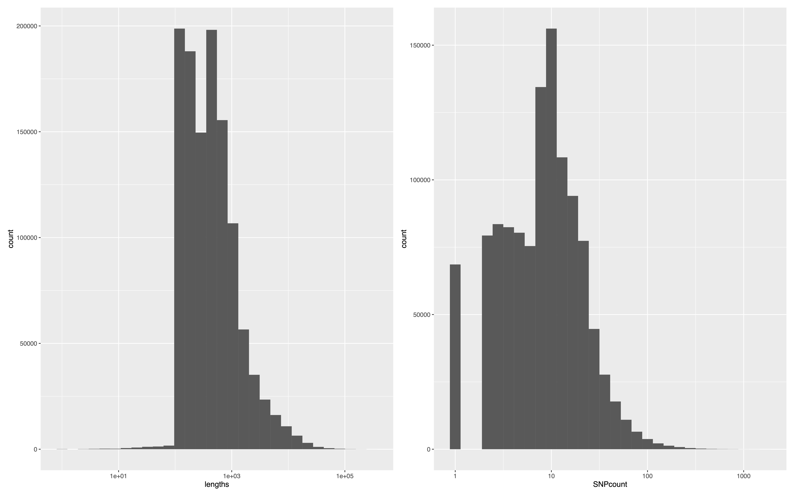

# Finding outlier windows using _GenWin_
We used the R package [_GenWin_](https://cran.r-project.org/web/packages/GenWin) ([Beissinger et al. 2015](https://doi.org/10.1186/s12711-015-0105-9)) to generate the windows to use for the analysis.  Rather than selecting an arbitrary window size (e.g., 25 kb) and step, GenWin fits a smoothed spline function to a metric (e.g., F<sub>ST</sub>) on each chromosome and subsequently uses changes in sign of the second derivative, or inflection points, to define windows. This directly taken from [Beissinger et al. 2015](https://doi.org/10.1186/s12711-015-0105-9):
>"We introduce a method for defining windows based on statistically guided breakpoints in the data, as a foundation for the analysis of multiple adjacent data points. This method involves first fitting a cubic smoothing spline to the data and then identifying the inflection points of the fitted spline, which serve as the boundaries of adjacent windows. This technique does not require prior knowledge of linkage disequilibrium, and therefore can be applied to data collected from individual or pooled sequencing experiments. Moreover, in contrast to existing methods, an arbitrary choice of window size is not necessary, since these are determined empirically and allowed to vary along the genome."

When using GenWin, we noticed there is a bug/issue in the current version v1.0.  If the `splineAnalyze` function only detects one inflection point (i.e. two windows), it throws an error.  I fixed this issue in the source code and created a new version: [GenWin v1.1](./data/GenWin_1.1.tar.gz).

### Step 1: Generate the windows
_R code to run GenWin on each scaffold and append to the output file `genwin.out.csv`_

```R
# Load Library (v1.1)
library(GenWin)

# Read in PoPoolation Fst file
data <- read.table("pools.fst", header = F, sep = "\t")[,c(1,2,6)]
colnames(data) <- c("Chrom", "Pos", "Fst")
   #14,439,829 sites

# Trim to just B1 vs B2 Fst without nan
data$Fst <- as.numeric(gsub("1:2=", "", data$Fst))
#data2 <- subset(data, !is.na(B1.clean.sorted.B2.clean.sorted.fst))

# Get full list of scaffolds
scaffolds <- unique(data$Chrom)
   #28,878 scaffolds in list

# Run GenWin by scaffold
for (i in 1:length(scaffolds)){
   tmp <- subset(data, Chrom == scaffolds[i])

   # This "if" statement avoids an error in the # of SNPs
   # The # SNPs must be >2*N+1 (N = 2, or the order of the polynomial in smooth.pspline)
   if (nrow(tmp) <= 5){
      message(paste0("Skipped scaffold ", scaffolds[i], " which had only ", nrow(tmp), " SNPs."))
   } else {
	   if (diff(range(tmp$Pos)) >= 100){
		   win <- splineAnalyze(Y = tmp$Fst,
                          map = tmp$Pos,
                          smoothness = 100,
                          plotRaw = FALSE,
                          plotWindows = FALSE,
                          method = 4)
	   } else if (diff(range(tmp$Pos)) < 100) {
              # This statement is to resolve an error when the SNPs on the scaffold
              # cover a region less than the smoothness parameter (100 bp)
                   win <- splineAnalyze(Y = tmp$Fst,
			  map = tmp$Pos,
			  smoothness = diff(range(tmp$Pos)),
			  plotRaw = FALSE,
			  plotWindows = FALSE,
			  method = 4)
           }
	   win <- cbind(Chrom = rep(scaffolds[i], nrow(win$windowData)), win$windowData)
	   write.table(win, file = "genwin.out.csv", append = T, quote = F, sep = ",", row.names = F, col.names = !file.exists("genwin.out.csv"))
	   message(paste0("Finished scaffold ", scaffolds[i]))
   }
}
```
Using the above script, we were able to identify 1,156,611 _de novo_ windows.
_Summary stats of the windows_
```R
# Load in window output
windows <- read.csv("genwin.out.csv", header = T)
   #1,202,291 windows
windows <- subset(windows, MeanY != "NA")
   #1,156,611 windows
windows$lengths <- windows$WindowStop - windows$WindowStart + 1
summary(windows$lengths); sd(windows$lengths)
summary(windows$lengths); sd(windows$lengths)

# Save output
write.table(windows, file = "windows.fst.csv", quote = F, sep = ",", row.names = F, col.names = T)

# Build Plots
library(ggplot2)
library(patchwork)
p1 <- ggplot(windows, aes(x = lengths)) + geom_histogram() + scale_x_continuous(trans='log10')
p2 <- ggplot(windows, aes(x = SNPcount)) + geom_histogram() + scale_x_continuous(trans='log10')
png(file = "windows.hist.png", width = 16, height = 10)
p1 + p2
dev.off()
```
<div align="center">
	
| Metric | Min | Mean (SD) | Max |
| --- | --- | --- | --- |
| Window Length | 1 | 977.6 (3057.6) | 299,828 |
| SNP Count | 1 | 12.4 (19.5) | 1,670 |
</div>

<p align="center">
  
</p>
<p align="center">
  <sup>Histograms of the window lengths inferred from _GenWin_ (left) and the number of SNPs per window (right).</sup>
</p>

### Step 2: Find Outlier Windows with Signifcant SNPs
We defined windows based on the F<sub>ST</sub> results. However, to find the outlier windows we then selected the windows containing at least two significant SNPs
   - as defined with the Fisher's exact test using a false discovery rate (FDR) < 0.01
These criteria are consistent with previous studies using poolseq (e.g. [Sly et al. 2022](https://doi.org/10.1073/pnas.2120482119))

_Identify the outlier windows matching the two criteria above_
```R
# Load in window output
windows <- read.csv("windows.fst.csv", header = T)
   #1,156,611 windows

##############################################################
###### Ignore this section, this is to save unused code ######
##############################################################
# Get percentiles (top 5%, 2.5%, 1%)
# p <- quantile(windows$MeanY, c(0.95, 0.975, 0.99))
#       95%     97.5%       99% 
# 0.1129424 0.1370687 0.1733967 

# Filter for just the top 1% outlier windows
# top1.win <- subset(windows, MeanY >= p[3])
##############################################################
################## End of section to ignore ##################
##############################################################

# Load in Fisher exact test data
SNPs <- read.table("pools.fet", sep = "\t", header = F)[,c(1,2,6)]
colnames(SNPs) <- c("Chrom", "Pos", "Q")
   #14,439,829 sites

# Calculate FDR and filter for significant SNPs
SNPs$Q <- as.numeric(gsub("1:2=", "", SNPs$Q))
SNPs$P <- 10^(-SNPs$Q) # convert Q value from Popoolation2 to P value
SNPs$FDR <- p.adjust(SNPs$P, method = "fdr") # FDR corrected P-values
SNPs.sig <- subset(SNPs, FDR < 0.01)
   # 1,890 SNPs

# Setup emtpy objects to store results
outliers <- data.frame()
count <- vector()

# Find the count of significant SNPs in each top 1% window
for (i in 1:nrow(windows)){
   tmp <- SNPs.sig[which(
      (SNPs.sig$Chrom == windows$Chrom[i]) &
      (SNPs.sig$Pos <= windows$WindowStop[i]) &
      (SNPs.sig$Pos > windows$WindowStart[i])),]
   count <- c(count, nrow(tmp))
   if (nrow(tmp) >= 2){
      outliers <- rbind(outliers, cbind(windows[i,], SigSNPs = nrow(tmp)))
   }
message(paste0("Finished window ", i))
}

# a total of 229 windows contained ≥ 2 significant SNPs
sum(count) # 1,890 SNPs overlapped the outlier windows.
sum(outliers$lengths)
   # [1] 479959
length(count[count == 0])
   # [1] 1155083
length(count[count == 1])
   # [1] 1299
length(count[count == 2])
   # [1] 160
length(count[count > 2])
   # [1] 69

# Save output table
write.table(outliers, file = "outlier-windows.fst.csv", quote = F, sep = ",", row.names = F, col.names = T)
```

_Manhatten plot code_
```R
# Load qqman library
library(qqman)

# Read in and prep full dataset
data <- read.csv("windows.fst.csv", header=T)
data$CHR <- as.numeric(factor(data$Chrom, labels = 1:length(unique(data$Chrom))))
data$BP <- (data$WindowStop + data$WindowStart) / 2
data$SNP = paste0(data$Chrom, "-", data$BP)

# Read in and prep just the significant windows
data.sig <- read.csv("outlier-windows.fst.csv", header = T)
data.sig$BP <- (data.sig$WindowStop + data.sig$WindowStart) / 2
data.sig$SNP = paste0(data.sig$Chrom, "-", data.sig$BP)

# Make Manhatten plot
pdf(file = "Rplots2.pdf", width = 16, height = 10)
manhattan(data, chrlabs = rep("", length(unique(data$CHR))),
   p = "MeanY",
   logp = F,
   cex = 1.0,
   col = c("blue4", "orange3"),
   suggestiveline = F,
   genomewideline = F,
   xlab = "Scaffold",
   ylab = "FST",
   xaxt = "n",
   highlight = data.sig$SNP)
dev.off()
```

### Step 3: Find overlapping genes
The last step of this section is to find the protein-coding genes annotated in or nearby these outlier windows. First, we downloaded the reference genome annotation file.

```bash
# Download the reference annotation from NCBI's FTP site
wget \
https://ftp.ncbi.nlm.nih.gov/genomes/all/GCA/013/398/685/GCA_013398685.1_ASM1339868v1/GCA_013398685.1_ASM1339868v1_genomic.gff.gz

# Uncompress the file and change its name
gunzip GCA_013398685.1_ASM1339868v1_genomic.gff.gz
mv GCA_013398685.1_ASM1339868v1_genomic.gff Aarun.gff

# Get just the location of full gene regions
grep -P "Genbank\tgene" Aarun.gff > Aarun.genes.gff

# Print list of unique gene IDs
grep -v "^#" Aarun.genes.gff | \
   perl -ne '/ID=gene-(ACRARU_[^;]+);/; print "$1\n"' | \
   sort | uniq
   # 13,698
```
In total, there are 15,576 annotated genes, but 1,878 were pseudogenes, resulting in 13,698 protein-coding genes. Next, we prepared the outlier windows containing ≥2 significant SNPs in bed format, and added 25 kb flanking region to each window. This flanking region is consistent with that of [Sly et al. 2022](https://doi.org/10.1073/pnas.2120482119). Last, we had to collapse the windows since some of them overlapped, and we didn't want to artificially return the same genes multiple times. All window-based analyses were perofrmed using [BEDtools v2.27.1](https://doi.org/10.1093/bioinformatics/btq033).

```bash
# Make genome file needed for BEDtools
samtools faidx Aarun.fa -o Aarun.genome

# In one big command, add window slop, merge, then intersect with genes
bedtools intersect \
   -wa \
   -a Aarun.genes.gff \
   -b <(bedtools merge \
      -i <(bedtools slop \
         -b 25000 \
         -i <(sed '1d' outlier-windows.fst.csv | tr "," "\t" | cut -f1-3) \
         -g Aarun.genome)) > outlier-genes.gff 
# 93 outlier genes

# A simple list of the 93 gene IDs
perl -ne \
   '/ID=gene-(ACRARU_[^;]+);/; print "$1\n"' \
   outlier-genes.gff > outlier-genes.list
```

In summary, the resulting output produced 229 windows containing ≥2 signifcant SNPs, and 93 genes overlapped with 25kb of these windows.  The total combined length of all 229 outlier windows was 479,959 bp.  Some of the output files are provided below:
- [windows.fst.csv (gzipped)](./data/windows.fst.csv.gz) :: all 1,156,611 windows inferred by GenWin (excluding "NA" windows).
- [outlier-windows.fst.csv](./data/outlier-windows.fst.csv) :: just the 229 outlier windows (containing ≥2 signifcant SNPs)
- [outlier-genes.gff](./data/outlier-genes.gff) :: gff file of the 93 genes in the outlier windows
- [outlier-genes.list](./data/outlier-genes.list) :: simple list of the 93 gene IDs
